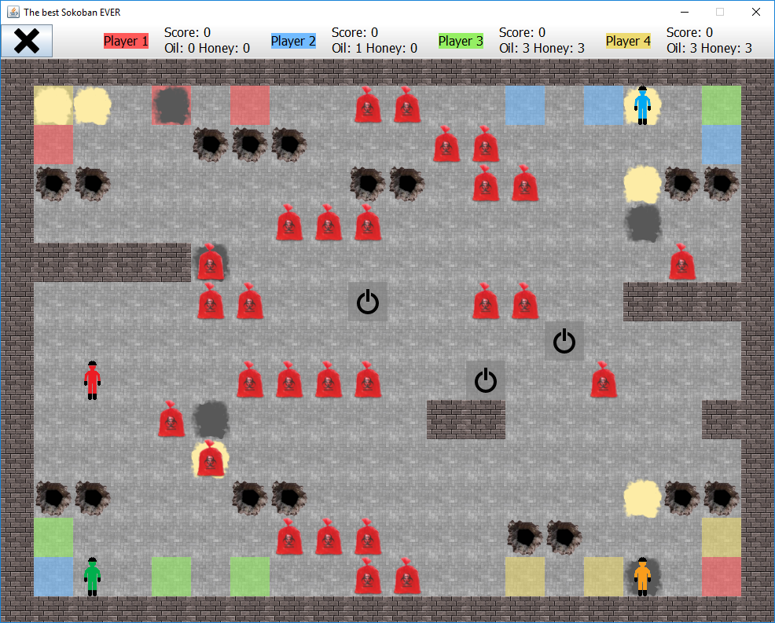
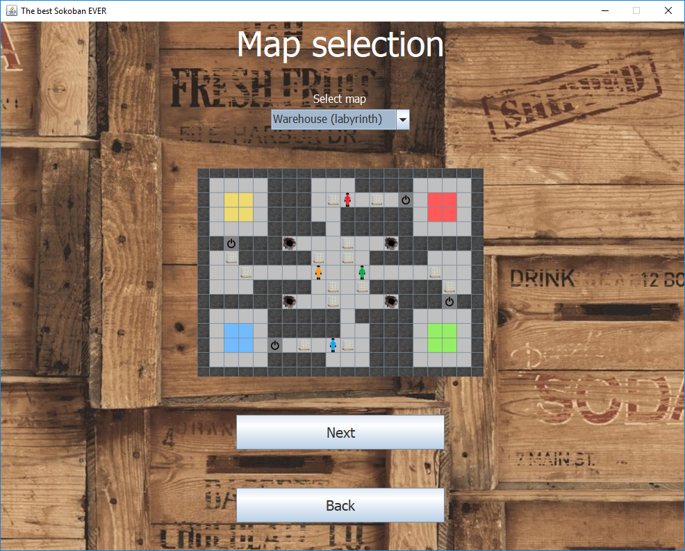
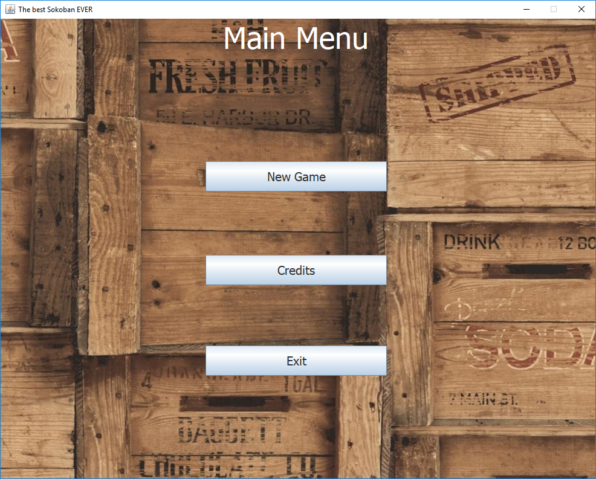

# Sokoban

This is a Sokoban-style Java SE multiplayer game written by 4 students as a university project. Pure MVC architecture and the SOLID principles were the key aspects to follow during the development. From 2 to 4 players can play in a game (on one PC). Numerous playgrounds, spreadable liquids and visual customization options are available.

